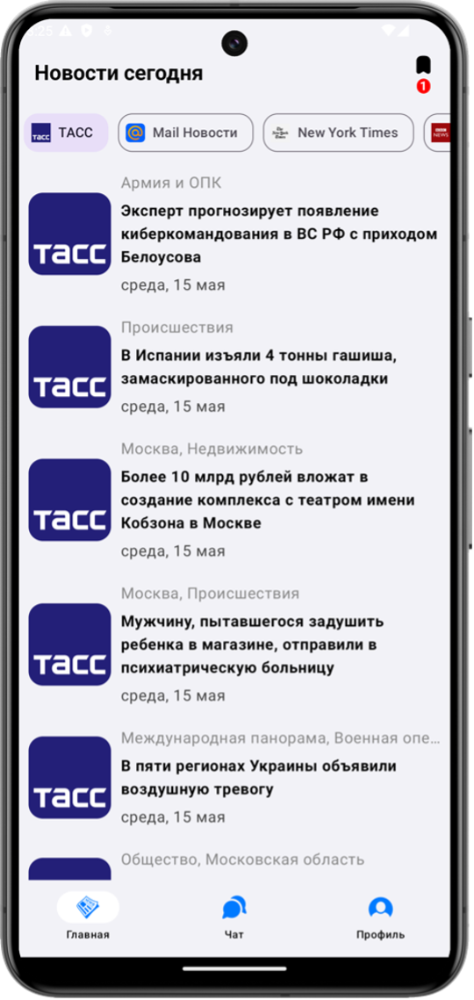
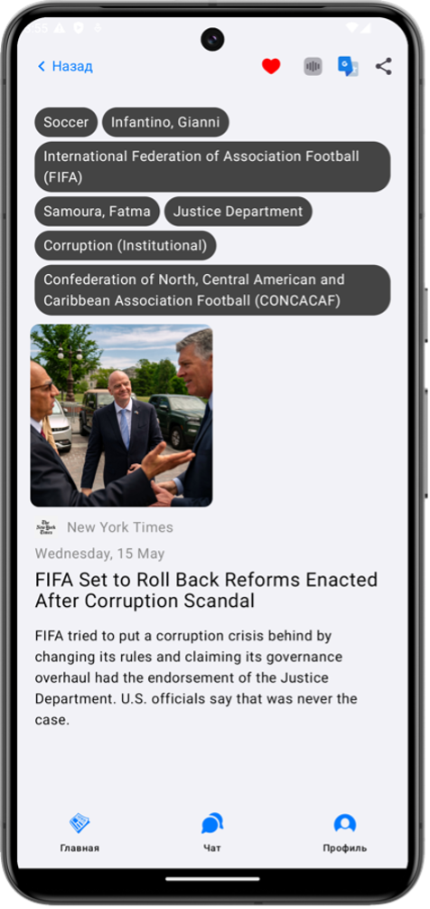
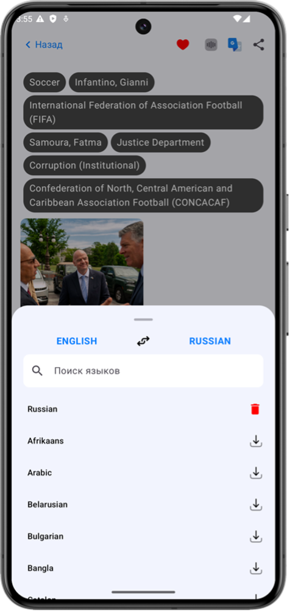
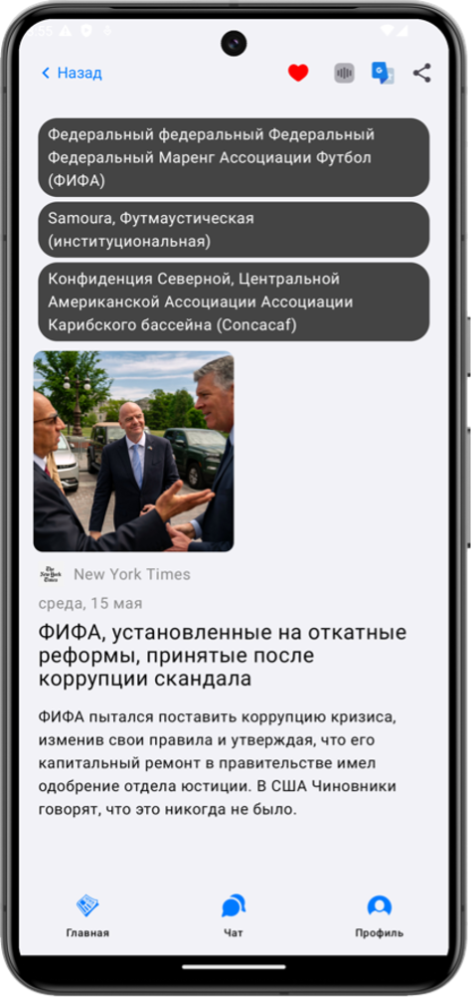
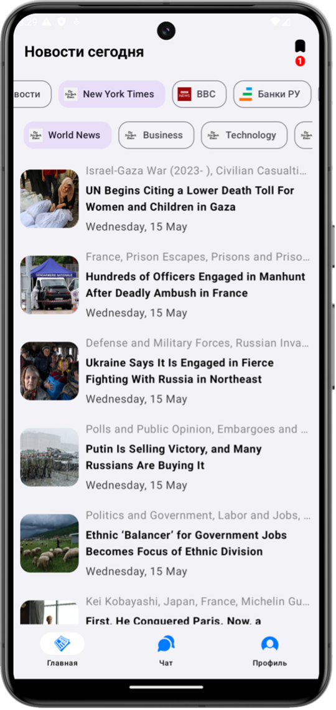
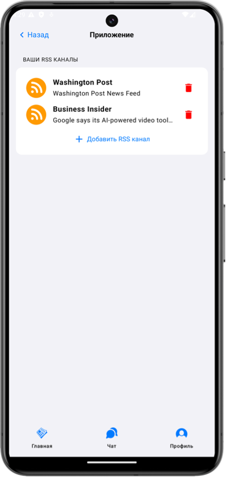
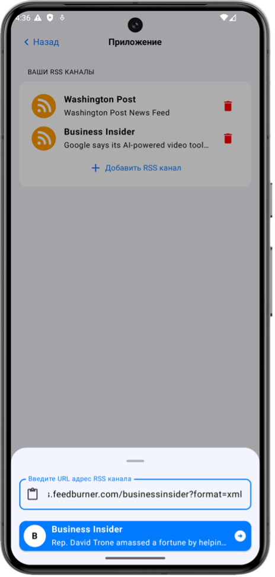

  <h1 align="center">AI News App</h1>
  

 

   
   
   
  
  
   

 

ZAI News — это новостное мобильное приложение с AI в открытом доступе, которое использует RSS каналы, а так же Telegram каналы. Основная цель этого приложения — стать ведущим примером создания современных приложений для всех разработчиков Android.

Идея состоит в том, чтобы сделать многомодульное приложение, демонстрируя при этом новые библиотеки и инструменты, которые упрощают создание высококачественных приложений для Android.

 

## Описание модулей:

|  Модуль |     Описание     |
|:----------:|:------------:|
|     app     |   Presentation слой   |
|  data |     Слой данных    |
| domain |     Domain слой    |
|     RSA    | RSA модуль |
| RSS | RSS модуль |
| SpeachTextCompose | Модуль чтения текста в Compose |
| TelegramAPI | TDP Telegram модуль |
| TranslateML | Модуль переводчика |

## Список используемых библиотек:
- Kotlin
- Coroutines, Flow
- Compose, Compose Navigation
- Glance, Glanse Material3 (App Widget)
- Dagger2, Hilt
- KSP
- Retrofit, Gson
- Room
- Paging
- Google ML Translate
- TDP Api
- Coil Compose
- Hidden Secrets (C++) Plugin
- Jsoup
- Kotlin Reflect

--------------------

### Скриншоты работы приложения:

  
  
  

  
  
  

--------------------

## License

The MIT License (MIT)

Copyright (c) 2024 Anton Zaitsev

Permission is hereby granted, free of charge, to any person obtaining a copy
of this software and associated documentation files (the "Software"), to deal
in the Software without restriction, including without limitation the rights
to use, copy, modify, merge, publish, distribute, sublicense, and/or sell
copies of the Software, and to permit persons to whom the Software is
furnished to do so, subject to the following conditions:

The above copyright notice and this permission notice shall be included in all
copies or substantial portions of the Software.

THE SOFTWARE IS PROVIDED "AS IS", WITHOUT WARRANTY OF ANY KIND, EXPRESS OR
IMPLIED, INCLUDING BUT NOT LIMITED TO THE WARRANTIES OF MERCHANTABILITY,
FITNESS FOR A PARTICULAR PURPOSE AND NONINFRINGEMENT. IN NO EVENT SHALL THE
AUTHORS OR COPYRIGHT HOLDERS BE LIABLE FOR ANY CLAIM, DAMAGES OR OTHER
LIABILITY, WHETHER IN AN ACTION OF CONTRACT, TORT OR OTHERWISE, ARISING FROM,
OUT OF OR IN CONNECTION WITH THE SOFTWARE OR THE USE OR OTHER DEALINGS IN THE
SOFTWARE.
